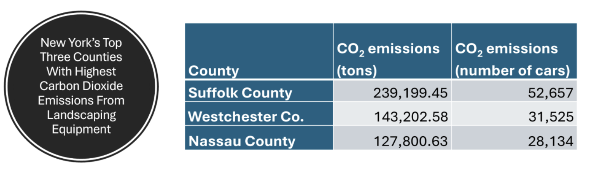

## Approach

In 2023, U.S. PIRG released a report, [***Lawn Care Goes Electric***](https://pirg.org/edfund/resources/lawn-care-goes-electric/), and [ranked](https://www.nypirg.org/pubs/202512/media_packet.pdf#page=5) U.S. states and counties by the amount of greenhouse gases and other pollutants emitted from gas-powered lawn equipment. Suffolk County, where I live, ranked highest for CO~2~ emissions in New York state, not surprisingly. (This is "Lawn Island," after all). As a resident of New York state, an environmental advocate, and an anti-leaf blower activist, I am curious to take a closer look at the data used in the report, which comes from the U.S. Environmental Protection Agency's (EPA) 2020 [National Emissions Inventory](https://www.epa.gov/air-emissions-inventories/2020-national-emissions-inventory-nei-data) (NEI).

Because the complete NEI 2020 dataset is too large for my computer to work with, I subsetted the data using the EPA's [Online 2020 NEI Data Retrieval Tool](https://awsedap.epa.gov/public/single/?appid=20230c40-026d-494e-903f-3f112761a208&sheet=5d3fdda7-14bc-4284-a9bb-cfd856b9348d&opt=ctxmenu,currsel). For Data Category, I selected "Non-Road Vehicles;" for EI Sector, I selected "Mobile Non-Road Equipment (Gasoline);" for State, I selected "New York," and for Source Classification Code I selected "Lawn and Garden Equipment." I may need to do further subsetting of the data depending on the specific analyses I want to do, in which case I will do that further subsetting in R (in this document).

I imported the CSV file into R:

```{r}
library(tidyverse)
NEI_2020 <- read_csv("NEI-2020.csv")
```

## Objective

Replicability is a vital part of the scientific process, although it is often considered the least "glamorous." However, with so much [data fraud](https://datacolada.org/) being exposed in science these days, replication should be given much greater attention.

My goal for this project is primarily to reproduce the county level CO~2~ emissions data for New York state. (Note: I don't doubt the results of PIRG's analyses. I am simply interested in looking further into the EPA data.) Replicating PIRG's analyses should be doable given that PIRG published their methods in their report. My project will demonstrate why replicability is important and how good documentation and methodological transparency facilitate (or hinder) replication in science.

## Code Base

In addition to ranking New York counties by CO~2~ emissions, I also planned to rank counties by particulate matter emissions, which are another important type of pollution that impacts public health. Particulate matter is classified according to its size. The EPA recognizes and collects emissions data on fine particulate matter (PM2.5, which are particles less than 2.5 micrometers in diameter) and coarse particulate matter (PM10, which are particles 10 micrometers or less).

Diverging from the original PIRG analyses, I wanted to collapse both types of particulate matter as well as both types of greenhouse gases (carbon dioxide and methane) that were included in the EPA data into single variables. This was the main challenge in terms of coding, as it required restructuring the data frame by creating new rows for the collapsed data and then deleting the original rows of data.

Doing this data table restructuring step-by-step would be doable, but messy and inefficient, since each emissions data point is uniquely associated with different categories of equipment, different counties, and different pollutants. Fortunately, I found a package, data.table, that does everything in a single function by recreating the data frame from the ground up. (I will explain how it works in the video assignment.) I also conveniently found and borrowed multiple functions introduced in Lab 2 of DATA 606 that were very helpful for this assignment.

First, I loaded the `data.table` package and converted the data frame to its proprietary data table format. Then I ran the function to sum the rows of PM2.5 and P10. Here you can see I also used the ifelse function from DATA 606 to tell R to create a new value for "Emissions (Tons)" called "PM" that holds the value of the sum of the emissions for PM2.5 and PM10 Pollutants, and otherwise keeps the existing values for all other Pollutants. Unfortunately, for this assignment, I ended up not doing any analyses on particulate matter, but it was a good exercise for me to learn about how to use the data.table package.

```{r}

library(data.table)
setDT(NEI_2020)

NEI_2020 <- NEI_2020[, .(`Emissions (Tons)` = sum(`Emissions (Tons)`, na.rm = TRUE)), by = .(State,`State-County`,`Pollutant Type`,`SCC Code`,`EIS Sector`,`Source Description`,`SCC LEVEL 1`,`SCC LEVEL 2`,`SCC LEVEL 3`,`SCC LEVEL 4`,`EPA Region`,FIPS,Pollutant = ifelse(Pollutant %in% c("PM2.5 Primary (Filt + Cond)", "PM10 Primary (Filt + Cond)"), "PM", Pollutant))]

```

I then used the filter function, again from Lab 2 of DATA 606, to remove all other pollutants besides cardon dioxide, methane, and particulate matter ("PM") from my data table.

I then cleaned up the data for County names using some regex. (I have only used regex for a computer science course I took a few years ago, and we only covered it for one week, so I did have to look up the necessary strings.) I also needed to clean up the County names because a bit later for this assignment I will be left joining this dataset with another dataset containing 2020 county-level population data for New York, and in order to do the left join, the County names have to match perfectly. Even after using the regex, however, the left join wasn't working, so I used str_squish() to remove any hidden whitespace around the string values for County. After this, the left join worked.

```{r}
NEI_2020 <- NEI_2020 %>% filter(Pollutant == "Carbon Dioxide" | Pollutant == "Methane" | Pollutant == "PM")

NEI_2020 <- NEI_2020 %>%
  mutate(
    `State-County` = `State-County` %>%
      str_remove("^NY-") %>%
      str_remove("\\s+$") %>%
      str_squish()
  )
```

Using the summarize function, again from Lab 2 of DATA 606, I recreated PIRG's rankings of New York state counties by emissions. Suffolk County, where I live, generates the most emissions from lawn and garden equipment.

However, note that I sum the emissions from carbon dioxide and methane, while PIRG only ranks emissions from carbon dioxide.

```{r}
NEI_2020_GHG <- NEI_2020 %>% filter(Pollutant == "Carbon Dioxide" | Pollutant == "Methane")
NEI_2020_GHG %>%
  group_by(`State-County`) %>%
  summarise(sum_Emissions = sum(`Emissions (Tons)`)) %>%
              arrange(desc(sum_Emissions))
```

This is one reason why my numbers don't match those from PIRG, although the county rankings are unchanged.

{fig-cap="The top 3 counties in New York state for carbon dioxide emissions from lawn and garden equipment. Source: NYPIRG (2025)"}

But note that PIRG's numbers are higher than mine for emissions, e.g. 239,199 tons for Suffolk County according to PIRG, compared to 208,216 according to my analyses. So if the difference was due to the fact that I summed CO~2~ and methane emissions, then my numbers should have been larger than PIRG's. I suspect that the actual reason for the discrepany is that we subsetted the data differently. For example, for non-road emissions from "lawn and garden equipment," PIRG included diesel fuel- and propane-powered equipment (PIRG 2023), while I did not.

Since methane is a more potent greenhouse gas than CO~2~ (approximately 28 times more potent, according to the EPA), it's not really appropriate for me to sum the emissions from those two different gases. Instead, what I should have done is converted the emissions from methane into a CO~2~ equivalent. That's exactly what I do next.

```{r}
NEI_2020_GHG <- NEI_2020 %>% filter(Pollutant == "Carbon Dioxide" | Pollutant == "Methane")
# Create a new column called GHG (for Greenhouse Gas) that displays the original CO2 emissions and the Methane emissions expressed in terms of CO2 equivalent.
NEI_2020_GHG <- NEI_2020_GHG %>%
  mutate(GHG_Emissions = ifelse(Pollutant == "Methane", (`Emissions (Tons)` * 28), `Emissions (Tons)`))

NEI_2020_GHG %>%
  group_by(`State-County`) %>%
  summarise(sum_Emissions = sum(GHG_Emissions)) %>%
  arrange(desc(sum_Emissions))

```

Total county emissions (whether from carbon dioxide alone or from all greenhouse gases combined) is an important metric, but we may also want to know how much of that emissions is a product of cultural differences among counties in terms of lawn and garden care, and how much is merely a factor of differences in population size for each county. We can gain further insight into this question by finding per capita emissions.

Here I upload the population dataset for New York state counties for 2020 from the U.S. Census Bureau. I then convert the population data into numeric, since it was coded as string type (because it contained commas). I then clean up the County values using regex, as I did for the NEI data.

```{r}
NY_pop <- read.csv("~/Documents/R/Data607/Week 1/co-est2025-pop-36.csv")

library(dplyr)
library(stringr)

NY_pop <- NY_pop %>%
  mutate(
    Population = parse_number(Population)
  )

NY_pop <- NY_pop %>%
  mutate(
    County = County %>%
      str_remove("^\\.") %>%
      str_remove("County, New York\\s*$") %>%
      str_squish()
  )
```

I now use the data.table function once again to sum the emissions for carbon dioxide and methane (in CO~2~ equivalents). The reason I have to do this is because when I used the summarize function above to sum the two GHGs, it only created a temporary instance rather than modifying the original data frame. Now I am actually modifying – or, more accurately, recreating – the data frame.

```{r}
NEI_2020_GHG <- NEI_2020_GHG[, .(Pollutant = "GHG", GHG_Emissions = sum(GHG_Emissions, na.rm = TRUE)), by = .(State,`State-County`,`Pollutant Type`,`EIS Sector`,`Source Description`,`SCC LEVEL 1`,`SCC LEVEL 2`,`SCC LEVEL 3`,`EPA Region`)]


```

```{r}
# Data check: Check if emissions stil matches from earlier:
NEI_2020_GHG %>%
  group_by(`State-County`) %>%
  summarise(sum_Emissions = GHG_Emissions) %>%
  arrange(desc(sum_Emissions))

```

Now I can left join the two data tables:

```{r}
# left join
NEI_2020_GHG <- NEI_2020_GHG %>%
  left_join(
    NY_pop %>% select(County, Population),
    by = c("State-County" = "County")
  )
```

And now I calculate per capita emissions by dividing county emissions by population size.

```{r}
NEI_2020_GHG <- NEI_2020_GHG %>%
  mutate(Per_Cap_Emissions = GHG_Emissions / Population)

```

And here are the rankings by per capita emissions:

```{r}
NEI_2020_GHG %>%
  select(`State-County`, Per_Cap_Emissions) %>%
  arrange(desc(Per_Cap_Emissions))
```

## Discussion

We see that Greene County (where the heck is that?) has the highest per capita emissions from lawn and garden equipment in New York state. Suffolk County falls to second place.

An additional analysis I could do to gain further insight into the relationship between counties and emissions is run a correlation test for population size and emissions. If there is a strong correlation, that would suggest that the emissions by county rankings, as originally reported by PIRG, are a bit misleading as PIRG doesn't account for the fact that maybe Suffolk County simply has a lot more people. Indeed, Suffolk County's population of 1,521,964 is fourth in the state. Nassau and Westchester Counties are also in the top ten. Nevertheless, we still find that Suffolk and Westchester's per capita emissions from lawn care are among the highest in the state (and the country, in fact).

## Conclusion

This was not a very robust analysis of the EPA data, but it was a good (and fun!) exercise for my first assignment. I may return to this data set for future assignments as there are obviously a lot more interesting analyses I can do with it, especially as my analytic toolbelt expands as the course progresses. Perhaps, not surprisingly, the most important lesson from this assignment was that it wasn't the analyses themselves that were the most challenging. In fact, the code for the analyses were quite simple. It was actually the wrangling and cleaning of the data, getting all the variables into the write type, formatting the values, and extracting the exact data that I needed that proved to be the most time consuming part of the assignment.

Data sources:

U.S. Environmental Protection Agency. (2020). 2020 National Emissions Inventory (NEI) Data. Triangle Park, NC. <https://www.epa.gov/air-emissions-inventories/2020-national-emissions-inventory-nei-data>. Raw Data URL: <https://raw.githubusercontent.com/chobowen/DATA-607/refs/heads/main/NEI-2020.csv>

U.S. Census Bureau, Population Division. (2026). Annual Estimates of the Resident Population for Counties in New York: April 1, 2020 to July 1, 2025 (CO-EST2025-POP-36). <https://www.census.gov/data/datasets/time-series/demo/popest/2020s-counties-total.html>.

References:

Dutzik, T., Sokolow, L., Metzger, L., and Schatz, K. (2023). Lawn Care Goes Electric. <https://publicinterestnetwork.org/wp-content/uploads/2023/10/Lawn_Care_Goes_Electric_Oct23.pdf>.

NYPIRG. (2025). NY county-by-county air pollution data from gas-powered lawn equipment shows health, environmental threats facing New York. <https://www.nypirg.org/pubs/202512/media_packet.pdf>.

U.S. Environmental Protection Agency. (2024). Greenhouse Gas Equivalencies Calculator. [https://www.epa.gov/energy/greenhouse-gas-equivalencies-](https://www.epa.gov/energy/greenhouse-gas-equivalencies-calculator#results)[calculator](https://www.epa.gov/energy/greenhouse-gas-equivalencies-calculator).
